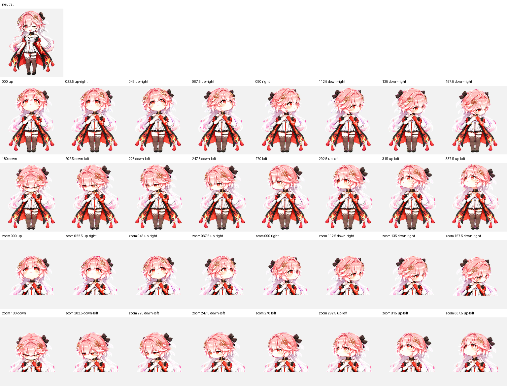

# 长离 · Changli Pet

粉发金瞳的长离工作伙伴。左臂从肘部到指尖带红色印记，披风外黑里红，两侧袖口有蝴蝶结。

本仓库提供透明精灵图和动画预览，适用于 ChatGPT Work Pets 的 v2 精灵图布局。当前版本保留原有动作间隔。

## 动画预览

[MP4 预览](previews/all-states.mp4) · [视线循环](previews/look-loop.gif) · [待机—跳跃—待机](previews/idle-jump-idle.gif)

## 文件

| 文件 | 用途 |
| --- | --- |
| `spritesheet.png` | 最终透明精灵图，用于支持该布局的 pet 导入或创建流程 |
| `pet.json` | 可移植的素材描述和帧布局；本仓库自定义元数据格式 |
| `previews/` | GIF、MP4、视线方向及关键帧展示 |
| `SHA256SUMS.txt` | 精灵图的 SHA-256 摘要 |

`pet.json` 不包含个人账户 pet ID、激活状态、上传会话或临时下载地址。它不是官方自动安装配置；仅上传这些文件到 GitHub 不会自动安装或选中 pet。创建时请使用 `spritesheet.png`。

## 精灵图布局

- PNG RGBA，1536 × 2288 像素。
- 8 列 × 11 行；每格 192 × 208 像素。
- 共 73 个有效帧，15 个空白透明格。
- 每行从最左侧开始放置有效帧；下表行号从 0 开始。

| 行 | 状态 | 帧数 |
| --- | --- | ---: |
| 0 | idle：待机 | 6 |
| 1 | running-right：向右跑步 | 8 |
| 2 | running-left：向左跑步 | 8 |
| 3 | waving：挥手 | 4 |
| 4 | jumping：跳跃 | 5 |
| 5 | failed：失败反应 | 8 |
| 6 | waiting：等待输入 | 6 |
| 7 | running：工作／思考 | 6 |
| 8 | review：检查 | 6 |
| 9 | 视线：000° 至 157.5° | 8 |
| 10 | 视线：180° 至 337.5° | 8 |

视线角度按屏幕坐标顺时针排列：000° 向上、090° 向右、180° 向下、270° 向左。部分斜向视线变化较细微。

## 上传到 GitHub

新建仓库后，将本文件夹中的文件和 `previews` 文件夹一起上传到仓库根目录。保留文件夹结构，README 中的预览链接即可正常显示。ZIP 是打包副本，上传前先解压。

## 素材说明

角色与视觉参考由用户提供，动作素材由 AI 辅助生成和整理。本包未附加开源许可证，也不声明拥有角色原作权利；发布和再使用需遵守相关权利方的授权条件。
