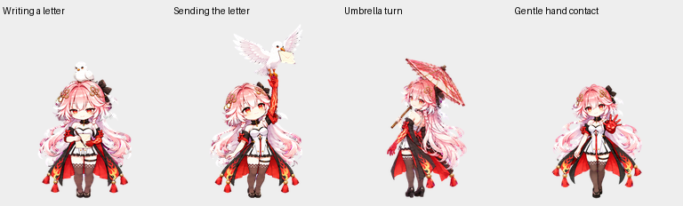

# 长离 · Changli

## v2.0.0 — 知性温柔版

长离的显示名称是“长离”；v2 是素材版本号。旧版在宠物列表中保留为“长离v1”。

粉发金瞳，左臂从肘部到所有指尖带红色印记，双袖蝴蝶结，披风外黑里红。

### 本版变化

- 删除俏皮眨眼、大笑与离地跳跃。
- 加入纸笔写信、信鸽落头停留、折信递信与信鸽展翅。
- 加入撑伞转身回眸微笑、伸出五指温柔邀请接触。
- 增加平静呼吸、轻抚发丝和温和思索动作。
- 保留十六个自然视线方向，调整人物在不同动作中的尺寸。

[MP4 预览](previews/all-states.mp4) · [撑伞衔接](previews/idle-umbrella-idle.gif) · [视线循环](previews/look-loop.gif)

## 文件

| 文件 | 内容 |
| --- | --- |
| `spritesheet.png` | 最终透明精灵图 |
| `pet.json` | 可移植的素材说明与动画帧布局，本仓库自定义元数据格式 |
| `previews/` | 动画与关键帧 |
| `CHANGELOG.md` | 版本变化 |
| `GITHUB_GUIDE.md` | 上传、备份旧版、建立分支、提交和合并操作 |
| `SHA256SUMS.txt` | 精灵图文件摘要 |

没有账户 pet ID、激活状态、本地路径、上传会话或临时下载地址。上传到 GitHub 不会自动安装宠物；创建时使用精灵图文件。`pet.json` 不是官方自动安装配置，也不控制触发间隔。

## 布局

透明 PNG RGBA，1536×2288，8列×11行，每格192×208；73个有效帧，15个空白格。行号从0开始。

| 行 | 播放器状态 | 本版动作 | 帧数 |
| --- | --- | --- | ---: |
| 0 | idle | 安静待机 | 6 |
| 1 | running-right | 向右移动 | 8 |
| 2 | running-left | 向左移动 | 8 |
| 3 | waving | 伸手邀请接触 | 4 |
| 4 | jumping | 撑伞转身回眸，无跳跃 | 5 |
| 5 | failed | 温和思索 | 8 |
| 6 | waiting | 信鸽落头与等候 | 6 |
| 7 | running | 提笔写信 | 6 |
| 8 | review | 折信递信、信鸽展翅 | 6 |
| 9 | look | 000°–157.5° | 8 |
| 10 | look | 180°–337.5° | 8 |

视线按屏幕坐标顺时针排列：000°上、090°右、180°下、270°左。

播放器决定状态切换顺序；实际使用不能保证每次完整播放寄信故事。连续演示将多个状态按故事顺序组合。信鸽离开阶段展示举手上方展翅起飞，未飞出画面。

## 素材说明

角色参考由用户提供，动作素材由 AI 辅助生成和整理。本包未附加开源许可证，不声明拥有角色原作权利；发布与再使用遵守相关权利方授权。
